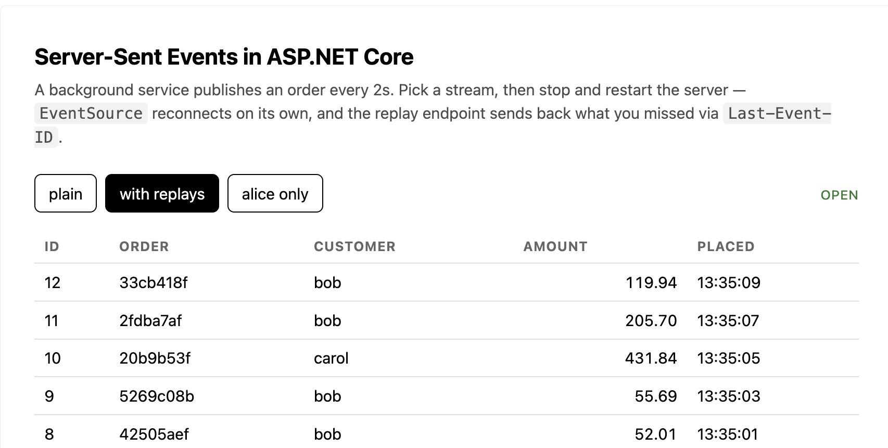

# Server-Sent Events in ASP.NET Core (.NET 10)

A minimal API sample of the built-in Server-Sent Events support in .NET 10

The demo page subscribes with
the browser's native `EventSource` — no client library, no SignalR, no WebSocket upgrade.



## Run it

```bash
dotnet run
```

Then open <http://localhost:5250>. Stop and restart the server while the page is open to
watch `EventSource` reconnect on its own and the replay endpoint send back what was missed.

## Endpoints

| Endpoint | Shows |
| --- | --- |
| `GET /orders/realtime` | `Results.ServerSentEvents(IAsyncEnumerable<T>, eventType)` — the plain case |
| `GET /orders/realtime/with-replays` | `TypedResults.ServerSentEvents(IAsyncEnumerable<SseItem<T>>)` with `Last-Event-ID` replay |
| `GET /orders/realtime/mine?customerId=` | Filtering the stream per caller inside the generator |
| `POST /orders` | Pushes an order into the stream by hand |

`SSE.http` has a ready-made request for each, including one that sends a `Last-Event-ID`
header. From the shell, `curl -N` shows the raw frames:

```
$ curl -N http://localhost:5250/orders/realtime/with-replays
event: orders
data: {"orderId":"8a86b25c","customerId":"carol","amount":471.34,"placedAt":"..."}
id: 1
```

Reconnecting with `Last-Event-ID: 2` replays `id: 3, 4, 5` immediately, then continues live
from `6` with no duplicates.

## How it fits together

Everything lives in [`Program.cs`](Program.cs) — endpoints on top, supporting types below
`app.Run()`.

- **`OrderBroadcaster`** — fans one published order out to every connected client, and
  stamps the event id once at publish time.
- **`OrderEventBuffer`** — a 50-item ring of recent events. `GetEventsAfter(lastEventId)`
  is what makes replay work. A real system would read this range back out of its event
  store instead.
- **`OrderProducer`** — a `BackgroundService` generating traffic so the page shows
  something the moment it loads.

The SSE endpoints themselves are just local `async IAsyncEnumerable` generators handed to
`Results.ServerSentEvents`. ASP.NET Core writes the `event:` / `data:` / `id:` frames, sets
`Content-Type: text/event-stream`, and holds the response open.
